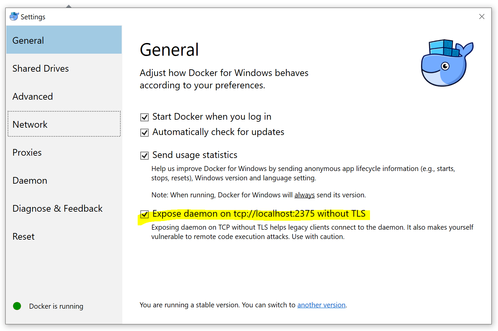

## Ballerina Kubernetes samples


### Prerequisites
 1. Install a recent version of Docker for Mac/Windows and [enable Kubernetes](https://docs.docker.com/docker-for-mac/#kubernetes) OR
    [Minikube](https://kubernetes.io/docs/tasks/tools/install-minikube/) is installed and running.
 2. [Nginx backend and controller deployed](#setting-up-nginx).
 3. Mini-kube users should configure following annotations in every sample with valid values: 
    ```bash
    @kubernetes:Deployment {
        dockerHost:"tcp://192.168.99.100:2376", 
        dockerCertPath:"/Users/anuruddha/.minikube/certs"
    }
    ```
 4. Docker for windows users should enable remote access to the API.
 (If DOCKER_HOST and DOCKER_CERT_PATH are exported as environment variables, priority will be given to environment variables.)
 
    
 5. [Heapster](https://github.com/kubernetes/heapster) monitoring configured.
    (This is **optional** and required only if Horizontal Pod Autoscaler are used. If you are running on GCE, heapster monitoring will be turned-on by default.)
    
    
#### Setting up nginx

1. Run the following command to deploy nginx backend and controller.
##### Docker for mac users:
```
kubectl apply -f nginx-ingress/namespaces/nginx-ingress.yaml -Rf nginx-ingress
```

##### minikube users:
```bash
minikube addons enable ingress
```

2. Verify nginx is up and running. (Namespace can be different based on you installation)
```bash
$> kubectl get pods --all-namespaces
NAMESPACE       NAME                                         READY     STATUS    RESTARTS   AGE
nginx-ingress   default-http-backend-69c767b879-l6pwj        1/1       Running   0          3d
nginx-ingress   nginx-5667df56c8-8d8ct                       1/1       Running   0          3d
```

## Try kubernetes annotation samples:

1. [Sample1: Kubernetes Hello World](sample1/)
1. [Sample2: Kubernetes Hello World with enableLiveness and hostname mapping](sample2/)
1. [Sample3: Ballerina program with multiple services running in multiple ports](sample3/)
1. [Sample4: Kubernetes Hello World Secured](sample4/)
1. [Sample5: Ballerina service with http and https endpoint](sample5/)
1. [Sample6: Kubernetes Hello World in Google Cloud Environment](sample6/)
1. [Sample7: Mount secret volumes to deployment](sample7)
1. [Sample8: Mount config map volumes to deployment](sample8)
1. [Sample9: Mount PersistentVolumeClaim to deployment](sample9)
1. [Sample10: Ballerina package with kubernetes annotations](sample10)
1. [Sample11: Kubernetes Hello World with Ballerina Function](sample11)
1. [Sample12: Copy External files to Docker Image](sample12) 